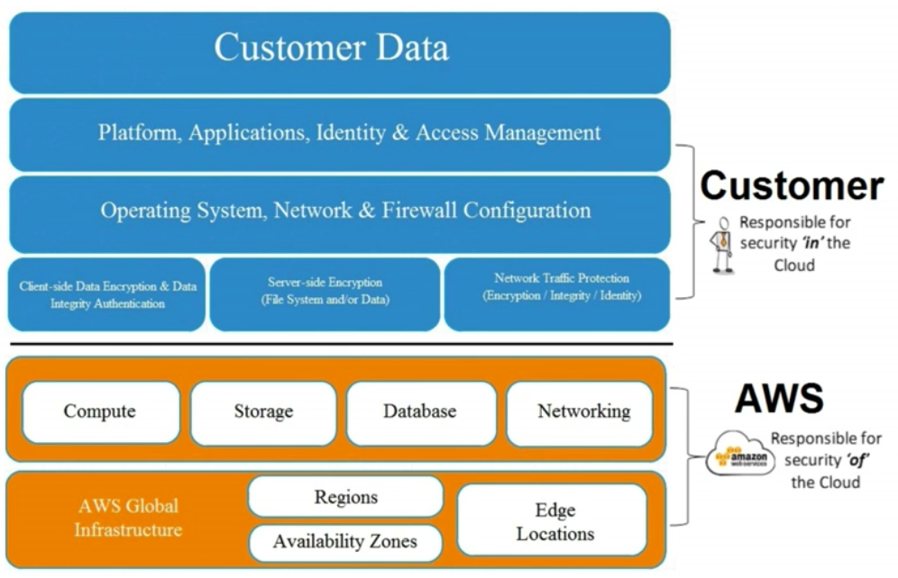

# Security Pillar
## Design Principles
- Apply security at all layers.
- Enable traceability. 
- Automate responces to security events. 
- Focus on securing your system.
- Automate security best practices. 
## Responsibility 
- Customer responsible for security in the cloud. 
- AWS responsible for security of the cloud. 

## Data Protection
- Basic data protection should be in place. Organise and classify data into segments such as publicly available, available only to members of the organisation, available only to board members etc. 
- Implement a least privledged access system so people can only access what they need. 
- Encrypt everything where possible, including data at rest and in transit. 
- AWS helps with this by: 
    - Customers maintain full access to their data. 
    - Make it easy to encrypt, including rotating encryption keys. 
    - Detailed logging is available. 
    - Storage systems have exceptional resiliency. 
    - Versioning is available to protect against accidental overwrites, deletions and similar harm. 
    - AWS never initiates the movement of data between regions.
## Priveldge Management 
- Only authorised and authenticated users are able to access resources, and only in a mannor that is intended. This includes:
    - Access control lists, role based access control, and password management. 
## Infrastructure Protection
- Outside of cloud, this is how you protect your data centre. Within AWS, they handle this so really infrastructure protection only exists at a VPC level. 
## Key AWS Services 
- Data protection: encrypt at rest and in transit using; ELB, EBS, S3, RDS. 
- Priveledge Management: IAM, MFA. 
- Infrastructure Protection: VPC.
- Detective controls: CloudTrail, CloudWatch, Config, S3, Glacier.
