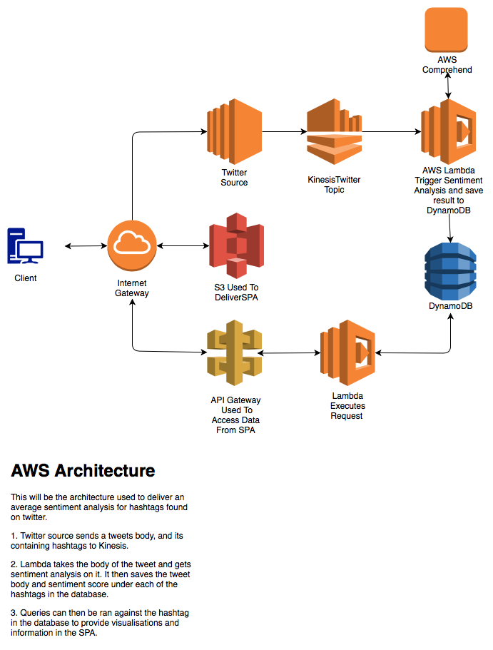

# Twitter Sentiment Project
This project aims to combine everything I have learned from the solutions architect course, and give a practical example of using AWS infrastructure. I will aim to use Terraform to script the environment allowing for an explicit documentation as to the infrastructure used.
